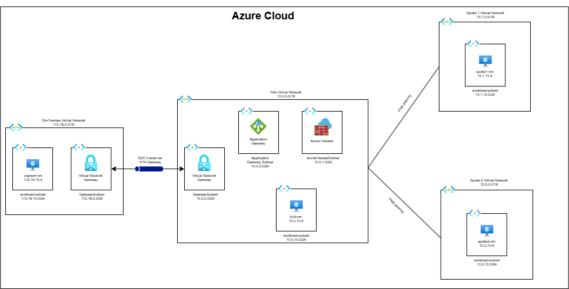
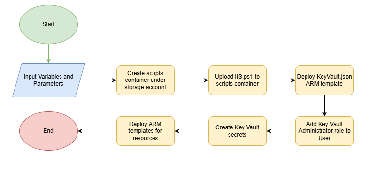
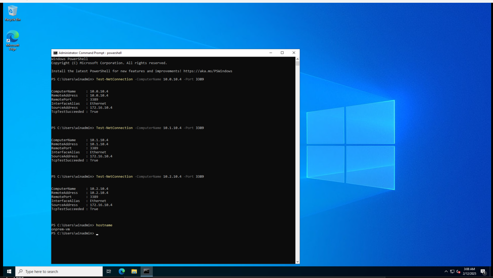
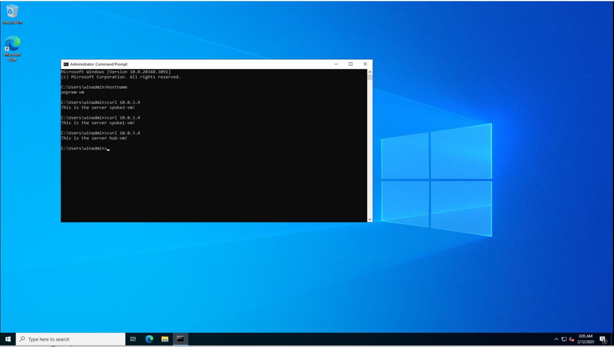
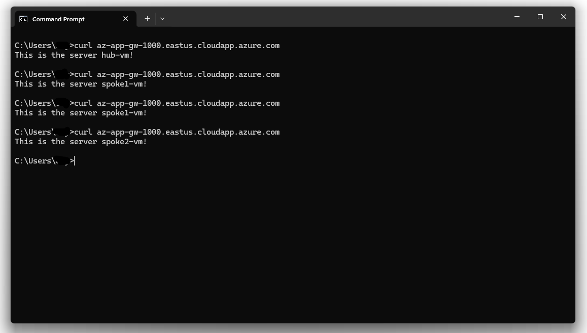

## Introduction

**Azure-Networking-01** project aims to engage into an increasingly complex Azure Virtual Network setup and starts with a deep dive in hub and spoke networking and user-defined routes, and then goes on by adding components such as the Azure Application Gateway, and Azure Firewall.

By completing this project, I have gained a comprehensive understanding of the following concepts:
* Virtual Machines and Custom Script Extensions
* Virtual Networks and Virtual Network peering
* Azure Key Vaults
* Network Security Groups
* Hub and Spoke design
* User Defined Routes and hybrid connectivity
* Azure Virtual Network Gateways
* Azure Firewall network and application rules
* Designs combining the Azure Firewall and the Application Gateway
* Azure Powershell
* Azure Resource Manager (ARM) templates 

## Diagrams

  

**Note**: To simulate a simple on-premise network, I've used a separate Azure Virtual Network with a network address of 172.16.0.0/16 and added a connectivity to the cloud network with an address block of 10.0.0.0/8 via Virtual Network Gateway. 
This simulates Site-to-Site (S2S) connectivity between the two network deployment. Hence, providing a connectivity between both sites.

**Note**: The project was developed using a Whizlabs Azure Sandbox subscription, which was limited to the resources provided therein. Therefore, no additional resource SKUs available on a pay-as-you-go basis were utilized. While the sandbox imposes certain limitations, a thorough exploration of the Azure documentation could potentially provide alternative methods and a different approach to what was employed in the project.

## Further Details
**Azure-Networking-01** project aims to engage into an increasingly complex Azure Virtual Network setup and starts with a deep dive in hub and spoke networking and user-defined routes, and then goes on by adding components such as the Azure Application Gateway, and Azure Firewall.

Since I am using a Whizlabs Azure Sandbox subscription, it is time limited to just a maximum of 3 hour per session. So, let's say you've created a session with a 3 hour limit, after the limit, all of your resources are now deleted and you're back to square one which drove me to create Azure Resource Manager templates in order to automate and redeploy resources faster. ARM templates are deployed via Azure Cloud Shell on each session by using "Hub-Spoke-Deployment.ps1" powershell script.

**Powershell script flow**:

  

When triggered, the powershell script first asks for desired variables to be used i.e. storage account name, keyvault name, local admin password (used on Virtual Machines), firewall policy name, and firewall name. It would then upload the custom script extension file ("IIS.ps1") which is used to download and run scripts on Azure VMs upon creation. After that, it will now deploy ARM template for Azure Key Vault creation ("KeyVault.json"). After the Key Vault is created, the script will now add a role (in this case, the role is Key Vault Administrator but please use least privilege principle) to the user and create "secrets" used to configure VMs and Virtual Network Gateway connection. It will now then proceed with resource creation as follows:

1. Network Security Group
2. Virtual Networks and Subnets
3. Virtual Machines
4. Virtual Network Gateway
5. Connect On-premise and Cloud gateways
6. Virtual Network Peering
7. Firewall Policy
8. Azure Firewall
9. Application Gateway
10. Route Tables

## The Objectives:
1. Onprem-vm should now be able to RDP on Hub-vm, Spoke1-vm, and Spoke2-vm
2. Onprem-vm can access the webpages hosted by cloud workload VMs through Application Gateway using Private IP and HTTP
3. Public requests (Allowed IPs) can reach the Application Gateway via Public IP
4. Traffic from onprem (RDP and HTTP) and public (HTTP via Application Gateway) gets inspected by Firewall

## Screenshots:

  

  

  

  

## What's Next:
I am looking into using linked ARM templates in deploying resources.  
Will also add the ability to create Log analytics workspace for monitoring.

